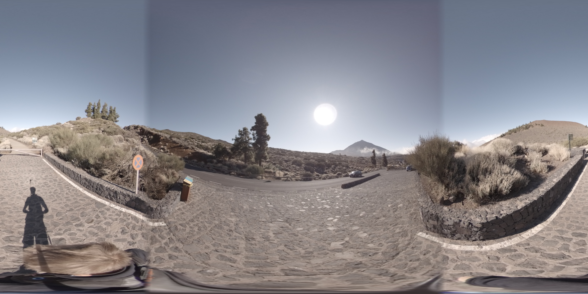

# Fusion2Sphere

Takes two raw GoPro Fusion frames (for front and back camera) and converts them to a single equirectangular projection.

[A full description of the scripts logic can be seen here](http://paulbourke.net/dome/dualfish2sphere/).

[Fusion2Sphere is implemented in our GoPro Frame Maker script which is probably better suited for your requirements](https://github.com/trek-view/gopro-frame-maker/).

## Installation

The fusion2sphere command line utility should build out of the box on Linux using the simple Makefile provided. The only external dependency is the standard jpeg library (libjpeg), the lib and include directories need to be on the gcc build path. The same applies to MacOS except Xcode and command line tools need to be installed.

```
$ git clone https://github.com/trek-view/fusion2sphere
$ make -f Makefile
$ @SYSTEM_PATH/fusion2sphere
```

## Usage

### Preparation

This script is designed to be used with frames.

If using video mode (not photos) you will first need to convert both `.mp4` videos to frames and then pass the two corresponding frames to the script.

You can use ffmpeg to split your `mp4` videos into frames (below at a rate of 1 FPS).

```
$ ffmpeg -i FRVIDEO1.mp4 -r 1 -q:v 1 FR/img%d.jpg 
$ ffmpeg -i BKVIDEO2.mp4 -r 1 -q:v 1 BK/img%d.jpg 
```

### Lighting issues

This script does not normalise for different lighting levels (apeture settings) on each lens.

You can see an example of the light/dark effect this leads to in our examples.



Therefore, you might want to proprocess frames to normalise lighting levels between front/back images.

### Script

```shell
$ fusion2sphere [options] track0filename track5filename parameter-file.txt
```

Options:

* -w n: sets the output image size, default: 4096
* -a n: sets antialiasing level, default: 2
* -b n: longitude width for blending, default: no blending
* -q n: blend power, default: linear
* -e n: optimise over n random steps
* -p n n n: range search aperture, center and rotations, default: 10 20 5
* -f flag needs two images one from front and second from back.
* -o flag outputs the final image.
* -d: debug mode

#### Examples (MacOS)

##### Use a GoPro Fusion 18mp photo

```shell
$ /Users/dgreenwood/fusion2sphere/fusion2sphere -b 5 -w 5760 -f testframes/18mp/FR/GF075169.JPG testframes/18mp/BK/GB075169.JPG -o testframes/18mp/STITCHED/G075169.jpg parameter-examples/photo-mode.txt
```

##### Use a GoPro Fusion 5.2k video frame

```shell
$ /Users/dgreenwood/fusion2sphere/fusion2sphere -b 5 -w 5200 -f testframes/5_2k/FR/GPFR7152_img1.jpg testframes/5_2k/BK/GPBK7152_img1.jpg -o testframes/5_2k/STITCHED/GP7152.jpg parameter-examples/video-5_2k-mode.txt
```

##### Use a GoPro Fusion 3k video frame

```shell
$ /Users/dgreenwood/fusion2sphere/fusion2sphere -b 5 -w 3000 -f testframes/3k/FR/GPFR0003_img1.jpg testframes/3k/BK/GPBK0003_img1.jpg -o testframes/3k/STITCHED/GP0003.jpg parameter-examples/video-3k-mode.txt
```

### Metadata

Note, the resulting image frames will not have any metadata -- this is not covered by the script.

[Our GoPro Frame Maker script can do this](https://github.com/trek-view/gopro-frame-maker/) ([the logic for which is described here](https://github.com/trek-view/gopro-frame-maker/docs/LOGIC.md))

### Camera support

This script has currently been tested with the following cameras and modes:

* GoPro Fusion
	* Unstitched 360 Videos (camera output: 2x mp4)
	* Unstitched 360 jpgs (camera output: x jpg)

## Support

Join our Discord community and get in direct contact with the Trek View team, and the wider Trek View community.

[Join the Trek View Discord server](https://discord.gg/ZVk7h9hCfw).